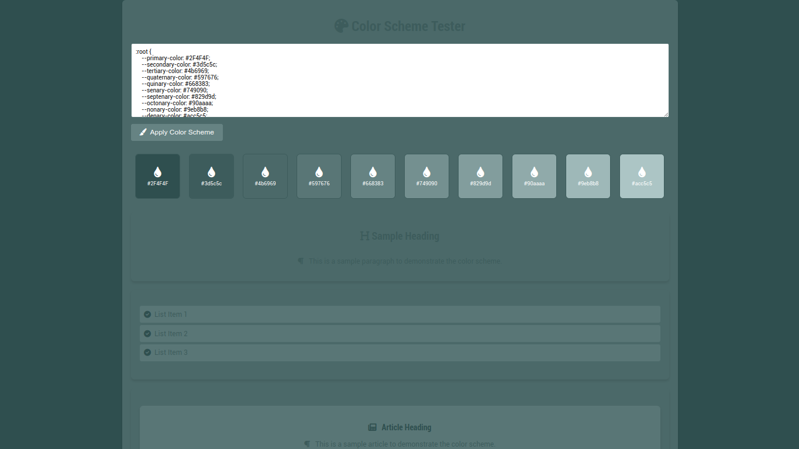

# Color Scheme Tester

## Overview

The **Color Scheme Tester** is a web application designed to allow users to test and visualize different color schemes. This application features a user-friendly interface where users can input their custom color schemes and see the changes applied in real-time. The project incorporates Material Design principles and provides various UI elements to showcase the applied color schemes.

## Features

- **Real-time Color Scheme Testing**: Input and apply custom color schemes.
- **UI Elements Demonstration**: Text areas, lists, articles, blockquotes, forms, and loading animations to showcase the color scheme.
- **Material Design Inspired**: Clean and modern UI with smooth transitions and hover effects.

## File Structure

- `index.html`: The main HTML file that structures the webpage and includes various UI components for color scheme testing.
- `styles.css`: The CSS file that defines the styles for the HTML elements, including color variables and animations.
- `script.js`: The JavaScript file that handles the application logic, such as applying the color schemes to the elements dynamically.

## Getting Started

### Prerequisites

- A modern web browser (e.g., Chrome, Firefox, Edge).
- Internet connection to load external Font Awesome icons.

### Installation

1. Clone the repository or download the ZIP file.
2. Extract the files to your desired location.

### Usage

1. Open `index.html` in your web browser.
2. Input your custom color scheme in the provided textarea in CSS variable format. For example:
    ```css
    :root {
        --primary-color: #2F4F4F;
        --secondary-color: #3d5c5c;
        --tertiary-color: #4b6969;
        --quaternary-color: #597676;
        --quinary-color: #668383;
        --senary-color: #749090;
        --septenary-color: #829d9d;
        --octonary-color: #90aaaa;
        --nonary-color: #9eb8b8;
        --denary-color: #acc5c5;
    }
    ```
3. Click the "Apply Color Scheme" button to see the color scheme applied to various UI elements on the page.

## Project Details

### HTML (`index.html`)

The HTML file contains various sections and elements including:
- Text areas
- Lists
- Articles
- Blockquotes
- Forms
- Loading animations

These elements help in visualizing how the color scheme would look across different UI components.

### CSS (`styles.css`)

The CSS file includes:
- Color variables defined using CSS custom properties (variables).
- Styles for various HTML elements, ensuring a cohesive look and feel.
- Hover effects and transitions to enhance the user experience.
- Keyframe animations for loading spinners.

### JavaScript (`script.js`)

The JavaScript file handles:
- Retrieving the user-input color scheme.
- Dynamically updating the CSS variables to apply the new color scheme to the document.
- Adding color boxes to display each color in the scheme visually.

## Screenshots



## Contributions

Contributions are welcome! If you have any ideas or improvements, please feel free to create a pull request or open an issue.
